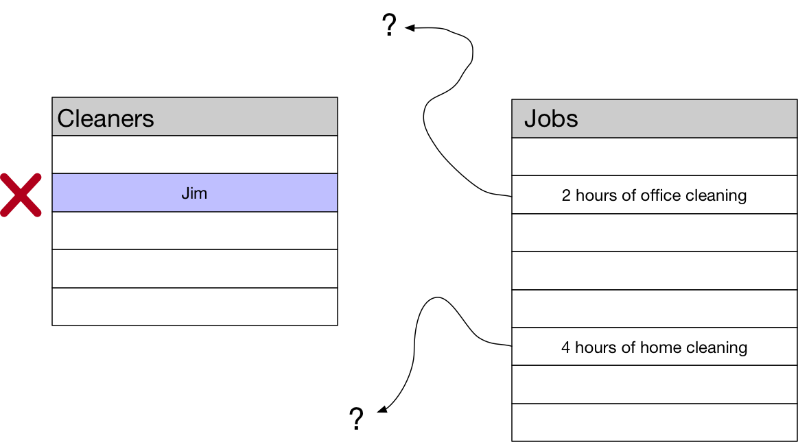

# Generic foreign keys: why not?

---?image=images/heres-why-not.png&size=80%

---?image=images/hey-why-not.png&size=60%

---?image=images/scales.jpg&size=80%

---
### Foreign key
- Reference that uniquely identifies a model
- Implemented at database level
- Firm guarantees of referential integrity
- Automatically indexed for performance
- Effortless querying forward and backwards

+++?image=images/referential_integrity_1.png&size=80%
## Referential Integrity

+++?image=images/cascade.png&size=80%
## Cascade 

+++?image=images/protect.png&size=80%
## Protect

+++?image=images/set_null.png&size=80%
## Set null

---
### Generic foreign key
- Reference that uniquely identifies a model
- ~~Implemented at database level~~
- ~~Firm guarantees of referential integrity~~
- ~~Automatically indexed for performance~~
- ~~Effortless querying forward and backwards~~

---?image=images/scarcely.png

---

### Generic foreign keys have this one weird trick
- ForeignKey can refer to one type of model
- GFKs can refer to any model in your application

---
### Let's keep track of changes to our models
```py 
class Event(models.Model):
    changes = JSONField()
    occurred_at = models.DateTimeField(auto_now_add=True)
    
    object_id = models.BigIntegerField()
    content_type = models.ForeignKey(ContentType)
    subject = GenericForeignKey('content_type', 'object_id')
```
@[1-3](We want to serialize the changes, and when they occurred)
@[5](We will store the ID of the model that changed)
@[6](We will store the type of the model that changed)
@[5-7](Wrap content_type and object_id as a GFK)

---
### Let's get meta with ContentTypes

- Model to describe models:

```py
>>> ct = ContentType.objects.get(
    app_label='customer', model='customer'
)
>>> ct.get_object_for_this_type(id=1)

<Customer: Gareth>
```
---

### The Generic Foreign Key field class
```py
class GenericForeignKey(object):
    def contribute_to_class(self, cls, name, **kwargs):
        cls._meta.add_field(self, private=True)
        setattr(cls, name, self)
        
    def __get__(self, instance):
        return instance.content_type.get_object_for_this_type(
            instance.object_id
        )
```
@[2-4](Add self to the model as a field, and descriptor)
@[6-9](Use the particular content type and ID to return referenced model)

---
### Record a change to a model
```py
class Cleaner(models.Model):
    name = models.CharField(max_length=128)
    
def record_changes(subject, attrs):
    changes = {getattr(subject, attr) for attr in attrs}
    Event.objects.create(subject=subject, changes=changes)

def set_cleaner_name(cleaner, name):
    cleaner.name = name
    cleaner.save()
    record_changes(cleaner, ['name'])
```
@[4-5]

---
### Record a change to a different type of model
```py
class Job(models.Model):
    cleaner = models.ForeignKey(Cleaner)
    started_at = models.DateTimeField()
    
def assign_job(job, cleaner):
    job.cleaner = cleaner
    job.save()
    record_changes(job, ['cleaner'])

def start_job(job):
    job.started_at = datetime.now()
    record_changes(job, ['started_at'])
```
@[9]

---
### Retrieval
```py
>>> first_event = Event.objects.order_by('occurred_at').first()
>>> first_event.subject

<Job: "Cleaning at Pam's">

>>> last_event = Event.objects.order_by('occurred_at').last()
>>> last_event.subject

<Cleaner: "Alex">
```

---
### Querying
```
>>> cleaner = Cleaner.objects.get(name='Alex')
>>> Event.objects.filter(subject=cleaner)

---------------------------------------------------------------------------
FieldError                                Traceback (most recent call last)
...
FieldError: Field 'subject' does not generate an automatic reverse relation...


>>> content_type = ContentType.objects.get_for_model(Cleaner)
>>> Spam.objects.filter(content_type=content_type, object_id=cleaner.id)]

<QuerySet [<Event: 'Name changed to Alex'>]>
```
@[10-11](We have to query explicitly on the content type and ID fields)

---
### Generic relation

```py
class Cleaner(models.Model):
    name = models.CharField(max_length=128)
    events = GenericRelation(Event)
    
>>> cleaner.events.filter(occurred_at__gte=date.today())

<QuerySet [<Event: 'Name changed to Alex'>]>
```
@[3](We know cleaners will be the subjects of events, so we can add the 'reverse' relationship)
@[5-7](We can now query similarly to the reverse relationship of a traditional foreign key)

---
### Generic relation with related query name
```py
class Cleaner(models.Model):
    name = models.CharField(max_length=128)
    events = GenericRelation(related_query_name='cleaners')
    
>>> Event.objects.filter(cleaners__name='Frederick')
<QuerySet [<Event: 'Name changed to Frederick'>]>
```
@[3]
@[5-7]

```sql
SELECT *
FROM "events_event"
INNER JOIN "cleaners_cleaner" ON (
    "events_event"."instance_id" = "cleaners_cleaner"."id"
    AND ("events_event"."content_type_id" = 41)
)
WHERE "cleaners_cleaner"."name" = 'Frederick'
```
@[8-13]

---
### Generic relation also enables aggregation
```py
>>> Cleaner.objects.aggregate(Min('events__occurred_at'))

{
    'events__created__min': (
        datetime.datetime(2015, 2, 26, 20, 35, 18, 771908, tzinfo=<UTC>)
    )
}

>>> cleaners = Cleaner.objects.annotate(Count('events'))
>>> cleaner = cleaners.get(name='Frederick')
>>> cleaner.events__count

2
```

---
## Ability to make polymorphic links between models, with a nice Django-style API

---
## Generic foreign keys considered harmful?

Core developers are warning us off

Luke Plant: <a href="https://lukeplant.me.uk/blog/posts/avoid-django-genericforeignkey/" target="_blank">Avoid Generic Foreign keys</a>.

Marc Tamlyn: <a href="https://www.youtube.com/watch?v=aDt4gu99_bE" target="_blank">Weird and wonderful things to do with the ORM</a>.

---
## Referential integrity



---
## Crude `on_delete` support

---
## Model changes can hurt your data

Let's change `Cleaner` to `HomeCleaner`

```sh
$ ./manage.py makemigrations
$ ./manage.py migrate
```

```py
>>> Event.objects.first().subject

---------------------------------------------------------------------------
AttributeError                            Traceback (most recent call last)

AttributeError: 'NoneType' object has no attribute '_base_manager'
```
---
## It couples your database schema to your application code

> Data matures like wine, application code matures like fish. Your database will likely outlast the application in its current incarnation, so it would be nice if it makes sense on its own, without needing the application code to understand what it is talking about.

---
# Purity


The purists are looking at this and shuddering

---
# Yeah, but at least it's not MongoDB
- I'm a pragmatist
- I can give up some purity for a practical solution

---
# Applications

---

## Common metadata across models
- Revisions
- Tags
- Ratings

---
### Hanging extra content related to any model
- Comments
- Messages
- Specialised data with different owners
    - Telephone numbers

---
### One model that needs to host different types
- Timeline entry
  - Can contain a link, a video, an image etc

---
### Portable Django apps
- Can be completely open to the user's own models
<br>
```py
class SentEmail(models.Model):
    text = models.TextField()
    
    object_id = models.BigIntegerField()
    content_type = models.ForeignKey(ContentType)
    sent_to = GenericForeignKey('content_type', 'object_id')
```
@[6]

---
# Patterns

---
## Build a really tight API
- 
---
## Go from parent to child
```py
for customer in Customers.objects.all():
    do_something(customer.events.all())
    
for event in Event.objects.all():
    if isinstance(event.subject, Customer):
        do_something(event)
    if isinstance(event.subject, Job):
        do_something_else(event)
```
@[1-2](Predictable collection of children)
@[3-7](Unpredictable parent: ugly branching)

---
## PROTECT your content types

```py
class SentEmail(models.Model):
    text = models.TextField()
    
    object_id = models.BigIntegerField()
    content_type = models.ForeignKey(ContentType, on_delete=PROTECT)
    sent_to = GenericForeignKey('content_type', 'object_id')
```
@[5](Cannot remove a content type referenced by an instance unknowingly)

---
## Perhaps use simulated deletion?

```py
class Job(models.Model):
    is_deleted = models.BooleanField(default=False)
```
@[2](Avoid dangling references by never deleting anything)

---
## Use `prefetch_related` on child models

```py
>>> Event.objects.all().select_related('subject')

---------------------------------------------------------------------------
FieldError                                Traceback (most recent call last)
...
FieldError: Invalid field name(s) given in select_related

>>> Event.objects.prefetch_related('subject')

<QuerySet [<Event: Changed name to Emma>,...]>
```
@[1-7](Cannot join to get down to 1 query)
@[8-10](It will do n+1 queries; number of distinct content types in results)

---
## Use `prefetch_related` on parent models with Generic Relations
```py
>>> Customer.objects.all().select_related('events')

---------------------------------------------------------------------------
FieldError                                Traceback (most recent call last)
...
FieldError: Invalid field name(s) given in select_related: 'events'

>>> Customer.objects.all().prefetch_related('events')

<QuerySet [<Customer: Gareth >...]>
>>> 
@[8-10](2 queries to get instances and their children)

---
## Index, index, index
- Index on object ID field, or your performance will stink
- Can `index_together` content type and object ID
    - Postgres can use multiple indices
    - indexing together is better for range queries, but don't often do ranges of IDs

---
# Conclusion
## There are no absolutes
## Use your head
